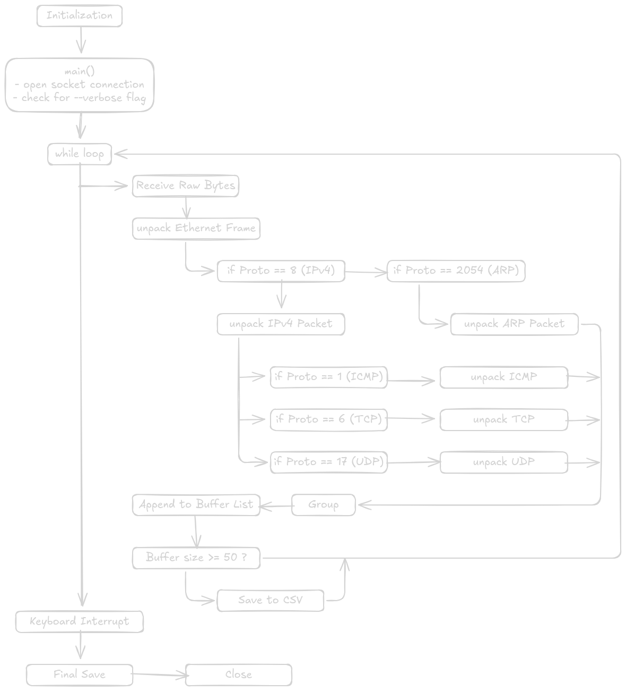

In an era of encrypted traffic and high-level APIs, the actual mechanics of how data moves across a wire can feel like "magic." To demystify this, I built **NetSniff**—a low-level network monitor that bypasses the standard OS abstractions to see the raw binary heartbeat of a network.


## What exactly is a "Sniffer"?

A network sniffer (or packet analyzer) is a tool that intercepts and logs traffic passing over a digital network. While most applications only see the "payload" (the message you sent), a sniffer sees the **envelope, the stamps, and the postmarks.** By putting the network interface into a mode where it captures every frame—not just the ones addressed to your computer—we can visualize the conversation between every device on the local link.

---

## The Anatomy of the Network "Onion"

To build NetSniff, I had to treat every packet like a Russian Nesting Doll. This is known as **Encapsulation**. My code performs **De-encapsulation** in reverse order:

### 1. The Ethernet Frame (The Outer Shell)

Every piece of data on a local area network (LAN) is wrapped in an Ethernet frame. It’s the "hardware" layer.

- **MAC Addresses:** These are the permanent physical IDs of your network card.
- **The EtherType:** This is a crucial 2-byte field. It tells my sniffer: "Hey, the next layer inside me is an IPv4 packet" (Value `8`) or "This is an ARP request" (Value `2054`).

### 2. The IP Packet (The Routing Layer)

Once we peel back the Ethernet header, we find the **Internet Protocol (IP)** packet. This is the "envelope" used to move data across the wider internet.

- **IP Addresses:** The logical Source and Destination (e.g., `192.168.1.1`).
- **TTL (Time to Live):** A counter that prevents packets from looping forever.
- **Protocol Field:** Just like the EtherType, this tells us what’s inside the IP packet—TCP, UDP, or ICMP.

### 3. The Transport Protocols (The Engines)

This is where the actual "work" happens. NetSniff is designed to handle the "Big Three":

- **TCP (Transmission Control Protocol):** The "Reliable" one. It uses a 3-way handshake. My code extracts **Flags** (URG, ACK, PSH, RST, SYN, FIN) to show if a connection is starting, ending, or resetting.
- **UDP (User Datagram Protocol):** The "Fast" one. No handshakes, just raw data. Great for streaming or DNS.    
- **ICMP (Internet Control Message Protocol):** The "Diagnostic" one. This is what `ping` uses to check if a server is alive.

---

## Flow: Code Architecture



---
## Technical Hurdles: Bitwise Operations

One of the most challenging parts of this project was dealing with **Network Byte Order (Big Endian)**. Computers store data differently than networks transmit it.

I used Python's `struct` module to map binary data to variables. For example, the IP version and Header Length are crammed into a single byte. To separate them, I had to use **Bitwise Shifting**:

```
version_header_length = data[0]
version = version_header_length >> 4  # Shift right 4 bits to get the version
header_length = (version_header_length & 15) * 4  # Use a mask to get the length
```

---

## Intelligent Data Handling: The Buffer System

Writing to a CSV file is a "slow" operation for a computer. If your network is busy, the sniffer might miss a packet while it's busy writing the previous one to the disk.

To solve this, I implemented a **Buffer Strategy**:

1. **List Storage:** Packets are held in a memory-resident list.
2. **Batch Processing:** Only when the list hits 50 packets does the `pandas` library trigger a write to the CSV.
3. **Schema Consistency:** Since an ARP packet has different fields than a TCP packet, I used a `base_fields` dictionary to ensure the CSV columns stay perfectly aligned, even when data is missing.

---

## Quick Start Guide

Want to try NetSniff yourself? Follow these steps:

1. **Clone:** clone the repository from **[GitHub](https://github.com/5yndr0m/netsniff)**
2. **Environment:** Create a virtual environment to keep your system clean.
```bash
python -m venv venv
source venv/bin/python  # On Linux
```
    
2. **Script:** Copy the `netsniff.py` into the virtual environment.  
3. **Dependencies:** You'll need `pandas` for the data export.  
```bash
pip install pandas
```
    
4. **Execution:** Because we are touching Raw Sockets, you **must** use `sudo`.
```bash
sudo ./venv/bin/python netsniff.py
```

5. **Logs:** To get terminal logs you can add `--verbose` flag.
```bash
sudo ./venv/bin/python netsniff.py --verbose
```

7. **Output:** Sniffed packets will be saved to the `capture_data.csv` file in the same directory 

---

## Troubleshooting & FAQ

- **"Why do I get Permission Denied?"**
    
    Raw sockets allow you to see traffic from other users and the OS. For security reasons, Linux requires `sudo` or `CAP_NET_RAW` privileges to run this.
    
- **"I'm on Windows and it's crashing!"**
    
    This specific implementation uses `AF_PACKET`, which is a Linux-specific socket type. For Windows support, one would typically use `WinPcap` or `Npcap` drivers.
    
- **"Why is the CSV empty?"**
    
    The sniffer waits for 50 packets before saving. If your network is quiet, try browsing a few websites to generate traffic, or hit `Ctrl+C` to force a final save of the remaining buffer.
    

---

**This project was a deep dive into the "low level" of the web. What should I sniff next? Maybe an HTTP traffic decrypter?**
